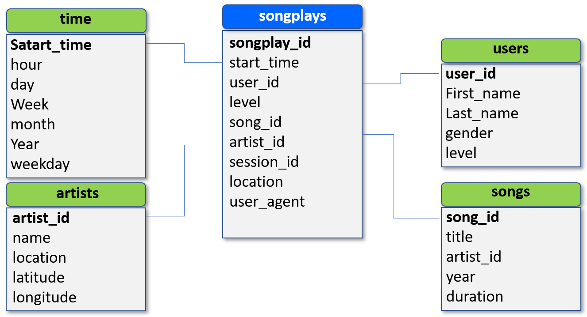

# Data Modeling with Postgres
> by Ali Fathalian, 30 June 2021
## Project
In this project data coming from audio streaming company called Sparkify has been modeled and prepared for analytics. They have raw JSON metadata but no easy way to query the data.
The goal of this project is to design and create a Postgres database (define fact and dimension tables for a star schema) and ETL pipeline (that transfers data from files in two local directories into the tables in Postgres) to optimize queries on song-play analysis.

## Requirements

1. Python 3
2. PostgreSQL 

## Datasets
#### Song Dataset
This dataset is a subset of real data from the [Million Song Dataset].  
Each JSON file has metadata for a particular track, with the following fields:
- *num_songs, artist_id, artist_latitude, artist_longitude, artist_location, artist_name, song_id, title, duration, year*

#### Log Dataset
This dataset is user songplay log files in JSON format generated by this [event simulator]. These simulate activity logs from a music streaming app based on specified configurations.  
Below is an example of what the data in 2018-11-12-events.json looks like:  
 
## Database Schema
This image shows the relational properties of the tables. It is a typical STAR schema, with the fact table (songplays) and dimension tables (songs, users, artists, and time).It is denormalized and optimized for simplified queries on song play analysis. 

### Instructions
1. Run **sql_queries.py** and check the datapaths is set to the proper Udacity paths.   
2. The **sql_queries.py** shows what SQL queries are used throughout the Python scripts.  
3. Run **create_tables.py** to create or reset the Postgres database.
4. Run **etl.py** to read and process the raw JSON files, and load the data into the Postgres tables.